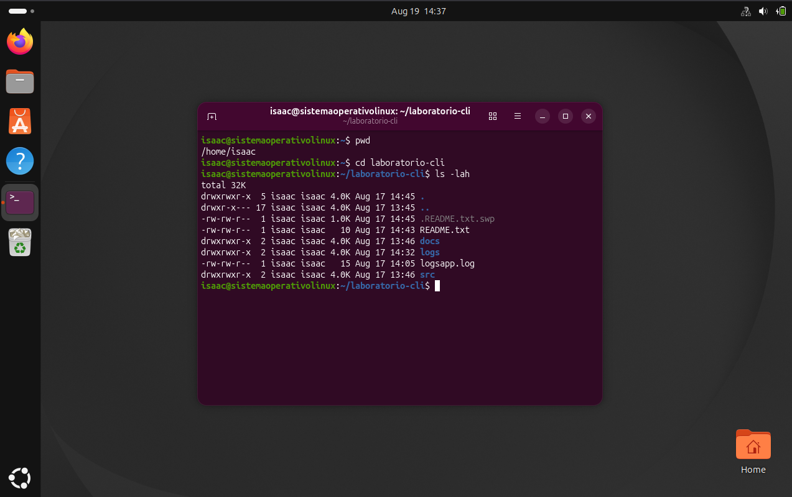

| Archivo / Directorio | Permisos |

| `.README.txt.swp` | 664 |

| `README.txt` | 664 |

| `docs` | 775 |

| `logs` | 775 |

| `logsapp.log` | 664 |

| `src` | 775 |

https://github.com/IL200/LINUX3C/commit/0f47a18ceaf3977088e124a5cf40e4b34f1771d5